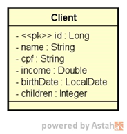

# Projeto de estudos - Cadastro de Clientes

#### Formação Desenvolvedor Moderno 
#### Módulo: Back end 
#### Capítulo: API REST, camadas, CRUD, exceções, validações
<div align= "center">


 [](https://www.oracle.com/java/technologies/javase/jdk17-archive-downloads.html) 

 [](https://spring.io/projects/spring-boot)

 [](https://www.jetbrains.com/pt-br/idea//)

 [](https://www.postman.com/)

</div>

## Features: CRUD de clientes
Você deverá entregar um projeto Spring Boot contendo um CRUD completo de web services REST para acessar um recurso de clientes, contendo as cinco operações básicas aprendidas no capítulo:
- Busca paginada de recursos
- Busca de recurso por id
- Inserir novo recurso
- Deletar recurso 

O projeto deverá estar com um ambiente de testes configurado acessando o banco de dados H2, deverá usar Maven como gerenciador de dependência, e Java como linguagem.
Um cliente possui nome, CPF, renda, data de nascimento, e quantidade de filhos. A especificação da entidade Client é mostrada a seguir (você deve seguir à risca os nomes de classe e atributos mostrados no diagrama): 



## DESAFIO
##### O projeto deverá fazer um seed de pelo menos 10 clientes com dados SIGNIFICATIVOS (não é para usar dados sem significado como “Nome 1”, “Nome 2”, etc.). 
##### Deverá tratar as seguintes exceções: 
   Id não encontrado (para GET por id, PUT e DELETE), retornando código 404. 
   Erro de validação, retornando código 422 e mensagens customizada para cada campo inválido. As regras de validação são: 
     o Nome: não pode ser vazio 
     o Data de nascimento: não pode ser data futura (dica: use @PastOrPresent) 
  
## Tecnologias
##### Principais ferramentas:

- [Validação] - Bean Validation
- [Aplicação web] - Spring WEB
- [Persistência] -Spring Data JPA
- [Database] - Spring Boot With H2 Database
- [Dependências] - Spring Boot Maven 
- [IDE] - IntelliJ
- [API] - Postman

```

```

[//]: # (These are reference links used in the body of this note and get stripped out when the markdown processor does its job. There is no need to format nicely because it shouldn't be seen. Thanks SO - http://stackoverflow.com/questions/4823468/store-comments-in-markdown-syntax)

   [Validação]: <https://jakarta.ee/specifications/bean-validation/3.0/apidocs/>
   [Aplicação web]: <https://docs.spring.io/spring-boot/docs/current/reference/html/web.html#web.servlet>
   [Persistência]: <https://spring.io/projects/spring-data-jpa>
   [Database]: <https://www.baeldung.com/spring-boot-h2-database/>
   [Dependências]: <https://docs.spring.io/spring-boot/docs/current/maven-plugin/reference/htmlsingle/>
   [IDE]: <https://www.jetbrains.com/pt-br/idea//>
   [API]: <https://www.postman.com/>
